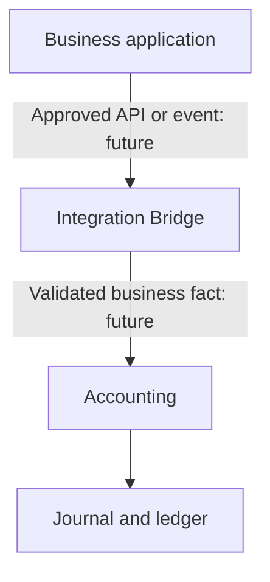

# Accounting Module Context

## Purpose

MAXI Accounting records approved financial interpretations as double-entry journals and projects posted facts into the General Ledger and Trial Balance.

## Boundary

No arrow in this diagram is implemented by foundation version 0.1.0. It documents the permitted future direction only. Direct database writes between programs are forbidden.

## Current internal flow

1. User explicitly creates accounts.
2. User records a journal draft with two or more exclusive debit/credit lines.
3. The core validates that posting totals are equal and greater than zero.
4. Posting freezes the journal.
5. Ledger and trial balance are derived from posted journals only.
6. Correction creates a separate reversal; it never edits the original posting.

## Non-goals

This foundation does not define tax, costing, inventory valuation, mappings, fiscal closing, approval roles, public events, APIs, multi-currency or production persistence.
